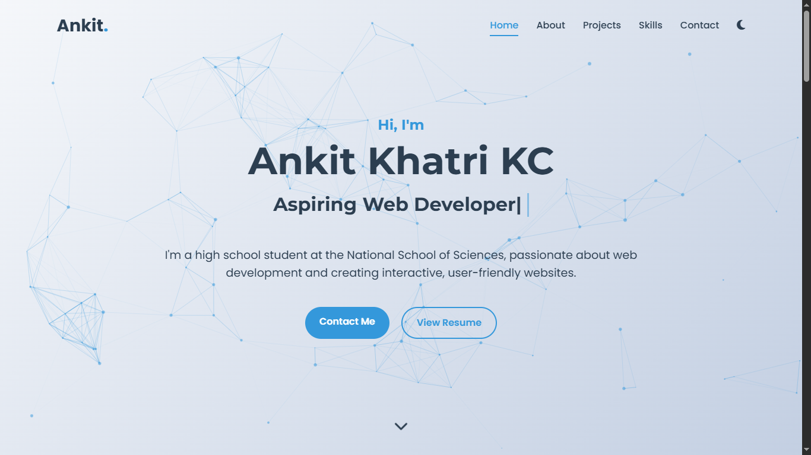

# 📝 Ankit Khatri KC - Portfolio Website 🌐



## ✨ Features

### 🎨 Modern Design
- 🖥️ Fully responsive layout
- 🌓 Light/Dark mode toggle
- 🎨 Custom color scheme
- ✨ Smooth animations and transitions

### 🛠️ Technical Highlights
- ⚡ Optimized performance
- 📱 Mobile-first approach
- 🔍 SEO-friendly structure
- ♿ Accessibility compliant

### 🧩 Components
- 🏠 Hero section with particles.js background
- ℹ️ About me section
- 💼 Projects showcase
- 🛠️ Skills section
- 📧 Contact form

## 🚀 Technologies Used

### Frontend
- 
- 
- 

### Libraries
- 
- 
- 
-  (Animate On Scroll)

## 🛠️ Installation

1. Clone the repository:
   ```bash
   git clone https://github.com/yourusername/portfolio.git
   ```

2. Navigate to project directory:
   ```bash
   cd portfolio
   ```

3. Open in your favorite editor and launch:
   ```bash
   code . && start index.html
   ```

## 🌈 Customization

### 🎨 Change Colors
Edit the CSS variables in `css/style.css`:
```css
:root {
    --primary-color: #3498db;
    --secondary-color: #2ecc71;
    /* ... */
}
```

### ✏️ Update Content
Edit the HTML files to update:
- Personal information
- Project details
- Skills list

## 📦 Dependencies

All dependencies are loaded via CDN:
- [Font Awesome](https://fontawesome.com/)
- [Google Fonts](https://fonts.google.com/)
- [jQuery](https://jquery.com/)
- [Typed.js](https://github.com/mattboldt/typed.js/)
- [Particles.js](https://github.com/VincentGarreau/particles.js/)
- [AOS](https://github.com/michalsnik/aos)

## 📝 License

This project is licensed under the MIT License - see the [LICENSE](LICENSE) file for details.

## 🙏 Acknowledgments

- Special thanks to all open source contributors
- Inspired by modern portfolio designs
- Built with ❤️ by Ankit Khatri KC

---

⭐️ Feel free to star the repository if you find this project useful!
